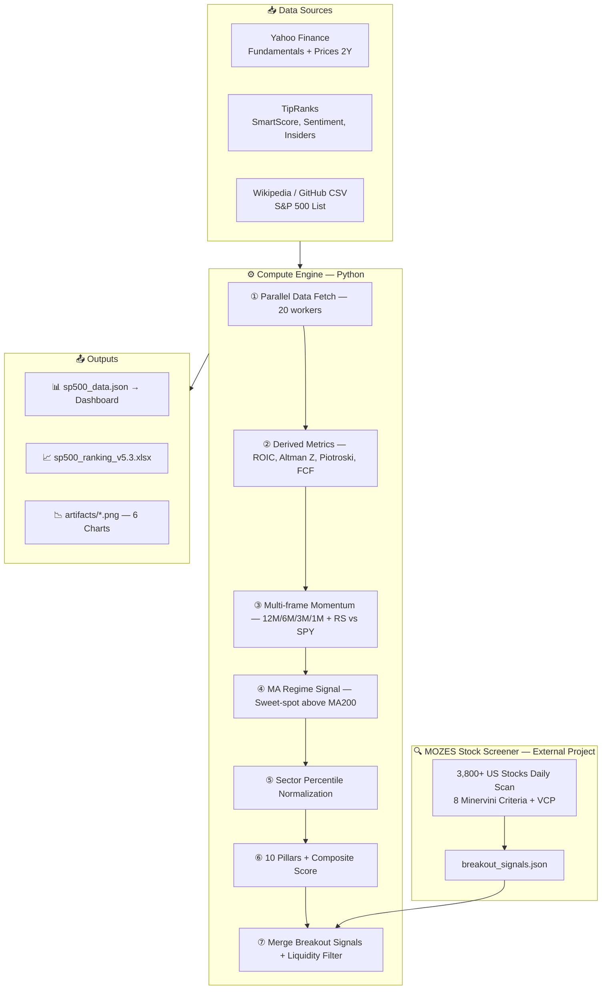
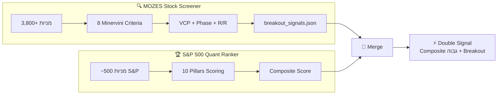

<div dir="rtl" align="right">

# 🏆 מערכת דירוג כמותי — S&P 500 Quant Ranker v5.4

### @MOZES Edition

---

## מה זה?

מערכת דירוג כמותית (Quantitative Ranking System) שמדרגת את כל ~500 המניות במדד S&P 500 לפי **10 פילרים של איכות**, ומייצרת ציון מרוכב (Composite Score) אחד עבור כל מניה.

המטרה: לזהות מניות שהן **בו-זמנית זולות, רווחיות, צומחות, ובמומנטום חיובי** — ולמיין את כולן מ-1 עד 500.

המערכת פועלת כ-GitHub Action מתוזמן, שואבת נתונים טריים מ-Yahoo Finance ו-TipRanks, מחשבת ציונים, ומייצרת:
- **דשבורד אינטראקטיבי** (HTML) עם 10 תצוגות, השוואת מניות, ו-Watchlist
- **קובץ Excel** עם דירוג מלא + ניתוח סקטוריאלי
- **6 גרפים** (Top 30, סקטורים, רדאר Top 5, ועוד)
- **קובץ JSON** להזנת הדשבורד

**ממשק גרפי למשתמש :  https://did.li/MozesRanker
**
---

## ארכיטקטורה



---

## מבנה הניקוד — 10 Pillars

המערכת מדרגת כל מניה ב-10 פילרים עצמאיים. כל פילר מנורמל ל-10–100 בתוך הסקטור שלו (sector percentile), כך שמניית טכנולוגיה מתחרה מול מניות טכנולוגיה — לא מול בנקים.

### טבלת משקלות

| # | פילר | משקל | סיגנלים | תיאור |
|---|-------|------|---------|-------|
| 1 | **Profitability** | 18% | ROE, ROA, ROIC, Net Margin, TR ROE | רווחיות — הפילר המשמעותי ביותר. חברה רווחית היא חברה בריאה. ROIC מחושב עם D&A ratio סקטוריאלי. |
| 2 | **Valuation** | 14% | P/E, PEG, EV/EBITDA, P/S, P/B | תמחור — האם המניה זולה ביחס לרווחים, מכירות ונכסים? מכפילים נמוכים = ציון גבוה. |
| 3 | **FCF Quality** | 12% | FCF Yield, FCF/NI, FCF Margin | איכות תזרים מזומנים חופשי — מזומן אמיתי שנכנס לחברה, לא רווח חשבונאי בלבד. |
| 4 | **Earnings Revisions** | 10% | Revision Score, EPS Revision 30d, Revision Ratio | שינויי הערכות אנליסטים — מהפקטורים החזקים ביותר לטווח קצר (Zacks 1979, Chan/Jegadeesh/Lakonishok 1996). |
| 5 | **Growth** | 10% | Revenue Growth, EPS Growth, Asset Growth | צמיחת הכנסות ורווחים ממשית. Asset Growth הפוך — צמיחת נכסים מוגזמת מנבאת תשואות נמוכות (Titman 2004). |
| 6 | **Earnings Quality** | 10% | Accrual Ratio, ROIC, Profit Margin, Gross Margin | האם הרווחים אמיתיים? FCF גבוה ביחס ל-Net Income = חברה שלא "ממציאה" רווחים. |
| 7 | **Financial Health** | 9% | Current Ratio, D/E, Altman Z, Beta | בריאות פיננסית — נזילות, מינוף, סיכון פשיטת רגל, ותנודתיות כאינדיקטור יציבות. |
| 8 | **Momentum** | 8% | Momentum Composite, TR Momentum, SMA Signal, Short Ratio, **MA Regime** | מומנטום מחיר + סיגנל MA200 sweet-spot (מתגמל כניסה מוקדמת, מעניש מתיחה). |
| 9 | **Relative Strength** | 7% | RS vs SPY 12M/6M/3M | עוצמה יחסית מול השוק — האם המניה מכה את ה-S&P 500 בחלונות זמן שונים? |
| 10 | **Analyst** | 2% | PT Upside, Insider Buying % MCap, Yahoo Rec | יעד מחיר + רכישות אינסיידרים + קונצנזוס אנליסטים. ללא SmartScore (נמנע מספירה כפולה). |
| | **סה"כ** | **100%** | | |

> **הערה:** כש-TipRanks לא זמין, המערכת עוברת אוטומטית למשקלות חלופיים שמתבססים רק על נתוני Yahoo Finance.

### פילר שמחושב אך אינו משוקלל

| פילר | סיבה |
|-------|-------|
| **Piotroski F-Score** | ללא נתוני שנה-על-שנה (Y/Y) מ-Yahoo Finance, הציון מבוסס על proxy-ים לא אמינים. מוצג בדשבורד ובאקסל לעיון בלבד. |

---

## MA Regime Signal — סיגנל ה-"מבצע"

אחד הסיגנלים הייחודיים במערכת. הרעיון המרכזי: מניה שזה עתה חצתה את קו הממוצע הנע 200 מלמטה למעלה, כשהממוצע עצמו עולה, נמצאת ב-**sweet spot** — היא ב-uptrend מוקדם, עדיין לא "מתוחה", ויחס הסיכוי/סיכון הוא המיטבי.

מנגד, מניה שטסה 30% מעל הממוצע כבר "מתוחה" — הסיכוי לתיקון גבוה, ולכן היא לא מקבלת בונוס מהסיגנל הזה.

### טבלת ניקוד

| מיקום ביחס ל-MA200 | ניקוד | הסבר |
|---------------------|-------|-------|
| מתחת ל-MA200 | 0.0 | סכנה — Stage 4, אין בונוס |
| 0–5% מעל MA200 עולה | **2.0** | 🎯 **Sweet spot** — נקודת כניסה אידיאלית |
| 5–15% מעל MA200 עולה | 1.5 | Uptrend בריא |
| 15–25% מעל MA200 | 0.5 | מתחיל להימתח |
| 25%+ מעל MA200 | 0.0 | מתוח מדי — אין בונוס |
| **בונוס Stage 2** | **+0.5** | מעל MA150 + MA200, שניהם עולים (מקסימום 2.5) |

> **בסיס אקדמי:** Brock, Lakonishok & LeBaron (1992) — ממוצעים נעים הם מהכלים הטכניים היחידים שנמצאו סטטיסטית מובהקים על פני 90 שנות נתונים. Mark Minervini (SEPA methodology) משתמש ב-MA150 + MA200 כתנאי כניסה מחייב ל-Stage 2.

---

## סיגנלים נבחרים — פירוט טכני

### ROIC — סקטוריאלי

נוסחת ה-Return on Invested Capital משתמשת ב-D&A ratio שונה לכל סקטור, משום שחברת תוכנה (D&A ~5%) וחברת אנרגיה (D&A ~25%) הן עולמות שונים:

| סקטור | D&A Retention | אופי |
|--------|--------------|------|
| Information Technology | 90% | Asset-light |
| Financials | 95% | D&A זניח |
| Health Care | 85% | R&D-heavy |
| Consumer Discretionary | 78% | קמעונאות, רכב |
| Industrials | 75% | Asset-heavy |
| Energy | 65% | PP&E intensive |
| Real Estate | 60% | פחת נכסים גבוה |

כאשר `operatingIncome` (EBIT) זמין מ-Yahoo Finance, הוא מקבל עדיפות על פני ה-proxy — זו הגישה המדויקת ביותר.

### Altman Z-Score — שלושה מודלים

| מודל | סקטורים | נוסחה | ספי |
|------|---------|-------|------|
| **Z** (מקורי) | תעשייה, אנרגיה, חומרים, צריכה | 1.2X₁+1.4X₂+3.3X₃+0.6X₄+1.0X₅ | >3.0 בטוח, <1.8 מצוקה |
| **Z''** (שירותים) | טכנולוגיה, בריאות, תקשורת, שירותים | 6.56X₁+3.26X₂+6.72X₃+1.05X₄ | >2.6 בטוח, <1.1 מצוקה |
| **דילוג** | פיננסיים, נדל"ן | — | המודל לא רלוונטי (חוב הוא המוצר) |

### Earnings Revision Score (0–5)

שלושה סיגנלים משולבים:

1. **רוחב (Breadth)** — יחס שדרוגים מול הורדות ב-30 יום. רוב השדרוגים = סימן חזק.
2. **עוצמה (Magnitude)** — אחוז שינוי ב-EPS consensus על פני 90 יום. שדרוג של 5%+ = סיגנל חזק.
3. **האצה (Acceleration)** — מומנטום שדרוגים ב-7 ימים אחרונים. "חם עכשיו" = בונוס.

### Analyst Pillar — ללא SmartScore

הרכב הפילר מבוסס אך ורק על סיגנלים **ייחודיים** שלא נספרים באף פילר אחר:

| רכיב | משקל בפילר | הסבר |
|------|------------|------|
| Price Target Upside (ממוצע Yahoo + TR) | 40% | פוטנציאל עלייה — סיגנל forward-looking ייחודי |
| Insider Buying % of Market Cap | 35% | "Skin in the game" — אינסיידרים שמים כסף אמיתי |
| Yahoo Recommendation Mean | 25% | קונצנזוס רחב — fallback כש-TR לא זמין |

> **למה בלי SmartScore?** ה-SmartScore של TipRanks כבר מגולם בפילרים אחרים (TR ROE → Profitability, TR Momentum → Momentum). לכלול אותו גם ב-Analyst = ספירה כפולה שמעוותת את הדירוג.

---

## סורק הפריצות — MOZES Stock Screener

### הפרויקט האחורי

סיגנלי הפריצה שמשולבים בדירוג מגיעים מפרויקט נפרד — [**MOZES Stock Screener**](https://github.com/Mozes2024/MOZES_stock-screener) — מערכת סריקה אוטומטית שרצה מדי יום דרך GitHub Actions וסורקת **3,800+ מניות אמריקאיות** לזיהוי מניות ב-Stage 2 Uptrend לפי מתודולוגיית Mark Minervini.

הסורק מייצר קובץ `breakout_signals.json` ש-Quant Ranker שואב ומשלב עם הדירוג הכמותי.

### 8 הקריטריונים של Minervini — Trend Template

מניה מוגדרת כ-Stage 2 Uptrend רק אם היא עוברת את **כל** 8 הקריטריונים:

| # | קריטריון | הסבר |
|---|----------|------|
| 1 | מחיר נוכחי מעל MA150 ו-MA200 | המניה נסחרת מעל שני הממוצעים הנעים הארוכים |
| 2 | MA150 מעל MA200 | הממוצע הקצר יותר מוביל — מבנה שורי |
| 3 | MA200 עולה לפחות חודש | הטרנד הארוך הוא חד-משמעית כלפי מעלה |
| 4 | MA50 מעל MA150 ו-MA200 | כל הממוצעים בסדר הנכון (50 > 150 > 200) |
| 5 | מחיר נוכחי מעל MA50 | המניה בטרנד קצר-טווח חיובי |
| 6 | מחיר לפחות 30% מעל שפל 52 שבועות | המניה כבר הוכיחה חוזק — לא "סכין נופלת" |
| 7 | מחיר לא יותר מ-25% מתחת לשיא 52 שבועות | עדיין קרובה לשיא — לא בתיקון עמוק |
| 8 | דירוג RS (Relative Strength) לפחות 70 | המניה מכה 70% מהשוק — מובילה, לא מפגרת |

> **מקור:** Mark Minervini, *Trade Like a Stock Market Wizard* (2013) ו-*Think and Trade Like a Champion* (2017). Minervini הוא אלוף השקעות דו-פעמי בתחרות ה-U.S. Investing Championship.

### תכונות הסורק

| תכונה | תיאור |
|--------|-------|
| **Phase Detection** | זיהוי אוטומטי של 4 שלבי מחזור שוק: Stage 1 (בסיס/צבירה) → Stage 2 (עלייה) → Stage 3 (שיא/הפצה) → Stage 4 (ירידה) |
| **VCP Detection** | זיהוי Volatility Contraction Pattern — צמצום תנודתיות מבסיס שמאלי לפריצה ימנית. 2–4 contractions אידיאלי |
| **Risk/Reward** | חישוב אוטומטי של יחס סיכוי/סיכון עם Stop Loss מחושב |
| **RS Momentum** | Relative Strength scoring חלק (ליניארי) מול SPY |
| **Smart Caching** | מנגנון cache חכם שמפחית 74% מקריאות ה-API |
| **Market Regime Filter** | סינון לפי מצב שוק כללי — מפחית סיגנלים בשוק דובי |
| **התראות אוטומטיות** | שליחת התראות על סיגנלים חדשים (email) |

### שילוב עם Quant Ranker — Double Signal ⚡

כשמניה מקבלת **גם** ציון Composite גבוה בדירוג הכמותי (פונדמנטלס + ערך + מומנטום) **וגם** סיגנל Breakout מהסורק (טכני + Stage 2 + VCP), זהו **סיגנל כפול** — שילוב של שני מנועים עצמאיים שמסכימים על אותה מניה:



השדות שמשולבים מהסורק לדשבורד ולאקסל:

| שדה | תיאור |
|------|-------|
| `breakout_score` | ציון פריצה כולל (0–100) |
| `breakout_rank` | דירוג בתוך כל המניות הפורצות |
| `breakout_phase` | Stage נוכחי (1/2/3/4) |
| `breakout_rr` | יחס Risk/Reward מחושב |
| `breakout_rs` | Relative Strength score |
| `breakout_stop` | Stop Loss מומלץ ($) |
| `has_vcp` | האם זוהה VCP pattern |
| `vcp_quality` | איכות ה-VCP (מספר contractions, עומק) |
| `breakout_entry_quality` | הערכת איכות נקודת הכניסה |
| `breakout_reasons` | רשימת סיבות לסיגנל |

> **הערה חשובה:** הסורק סורק את **כל** השוק האמריקאי (3,800+ מניות), לא רק S&P 500. לכן, חלק מהמניות ב-breakout_signals.json לא יימצאו ב-S&P 500 — ה-merge שומר רק את החפיפה.

---

## קבצי הפרויקט

```
SP500-Quant-Ranker/
├── sp500_github.py            ← מנוע חישוב ראשי (~1,940 שורות)
├── test_scoring.py             ← 52 unit tests
├── index.html                  ← דשבורד אינטראקטיבי (EN/HE)
├── sp500_data.json             ← נתוני JSON לדשבורד
├── breakout_signals.json       ← סיגנלי פריצה (Minervini Stage 2)
├── run_fresh_no_cache.py       ← הרצה ללא cache
├── requirements.txt            ← תלויות Python
├── README.md                   ← הקובץ הזה
└── artifacts/
    ├── sp500_ranking_v5.3.xlsx
    ├── sp500_data.json
    ├── top30_composite.png
    ├── sector_scores.png
    ├── valuation_vs_quality.png
    ├── smartscore_dist.png
    ├── momentum_decomp.png
    └── top5_radar.png
```

---

## הרצה

### דרישות מקדימות
```bash
pip install yfinance pandas numpy openpyxl==3.1.2 requests beautifulsoup4 matplotlib seaborn tqdm scipy
```

### הרצה רגילה (עם cache)
```bash
python sp500_github.py
```

### הרצה מלאה ללא cache
```bash
python run_fresh_no_cache.py
```

### הרצת טסטים
```bash
python -m pytest test_scoring.py -v
# 52 passed ✅
```

---

## מקורות נתונים

| מקור | נתונים | הערות |
|------|--------|-------|
| **Yahoo Finance** | Fundamentals, מחירים (2 שנים), EPS Revisions, Analyst Consensus | API רשמי, 20 workers מקביליים |
| **TipRanks** | SmartScore, סנטימנט, אינסיידרים, Hedge Funds, PT | Mobile API ללא מפתח — עלול להישבר. יש fallback weights |
| **Wikipedia** | רשימת חברות S&P 500 | עם 2 fallbacks (GitHub CSV, hardcoded) |
| **MOZES Stock Screener** | סיגנלי פריצה, VCP, Phase, R/R, Stop Loss | פרויקט נפרד — [GitHub](https://github.com/Mozes2024/MOZES_stock-screener) |

> כש-TipRanks לא זמין, המערכת עוברת **אוטומטית** למשקלות חלופיים (`CFG_WEIGHTS_NO_TR`) שמבטלים את הפילרים התלויים ב-TR ומחזקים את הפילרים הפונדמנטליים.

---

## Changelog — v5.3

### 🔴 תיקוני באגים קריטיים
| באג | בעיה | פתרון |
|-----|------|-------|
| **B1 — ROIC** | D&A proxy קבוע (82%) עיוות השוואות חוצות-סקטור | D&A ratio per-sector + העדפת `operatingIncome` |
| **B2 — FCF Zero** | `FCF=0` החזיר NaN במקום 0.0 (באג Python truthy) | Helper function `_ratio()` עם NaN-check מפורש |
| **B3 — Altman Z** | סקטור לא מוכר נפל בשקט ל-Z'' ללא התראה | Warning log + fallback מפורש |
| **B4 — `_safe()`** | הוגדר 200 שורות אחרי השימוש הראשון | הועבר לפני `_get_one()` |
| **B5 — Coverage** | עונש כפול — פעם ב-composite, פעם ב-coverage factor | Penalty ליניארי, רק מתחת 70% coverage, מקסימום 15% |

### 🟠 שיפורי מודל
| שינוי | לפני | אחרי | ביסוס |
|-------|------|-------|-------|
| **Earnings Revisions** | חלק מ-Growth (effective ~5.6%) | **פילר עצמאי ב-10%** | Zacks 1979 — alpha factor חזק |
| **MA Regime Signal** | לא קיים | Sweet-spot scoring ב-Momentum pillar | Brock/Lakonishok/LeBaron 1992 |
| **Analyst Pillar** | 0% (מבוטל) | **2%** — PT + Insider + Yahoo, בלי SmartScore | הימנעות מספירה כפולה |
| **Insider Buying** | מחושב אך לא בשימוש | 35% מ-Analyst pillar | Seyhun 1986 — insider alpha |
| **Piotroski** | 0% אך עדיין ב-PILLAR_MAP | הוסר מ-PILLAR_MAP (display only) | ניקיון ארכיטקטורי |

### 🟡 תשתית
- **52 Unit Tests** — כיסוי מלא: scoring functions, structural integrity, edge cases
- **Version Sync** — כל ההפניות מסונכרנות ל-v5.3

---

## פילוסופיית השקעה של המערכת

המערכת בנויה סביב עיקרון מרכזי: **מניה טובה במחיר טוב בזמן טוב**.

- **"מניה טובה"** — Profitability + Earnings Quality + FCF Quality (40% מהמשקל) מוודאים שזו חברה שיודעת להרוויח כסף אמיתי.
- **"במחיר טוב"** — Valuation (14%) מוודא שאנחנו לא משלמים יותר מדי. MA Regime מתגמל מניות שנמצאות ב-sweet spot ולא מתוחות.
- **"בזמן טוב"** — Momentum + RS + Earnings Revisions (25%) מוודאים שהשוק מסכים איתנו ושיש רוח גבית.

זו גישת **GARP (Growth at a Reasonable Price)** עם שכבת מומנטום — לא ספקולטיבית ולא שמרנית מדי. חברות איכותיות, במחיר הוגן, עם רוח גבית.

---

> ⚠️ **מערכת זו היא כלי עזר לניתוח — לא המלצה לקנייה או מכירה.**
> הדירוגים מבוססים על נתונים היסטוריים ונוכחיים בלבד. ביצועי עבר אינם מנבאים ביצועי עתיד.
> יש לבצע מחקר עצמאי ולהתייעץ עם גורם מוסמך לפני כל החלטת השקעה.

---

<div align="center">

**נבנה ע"י @MOZES · גרסה 5.3 · פברואר 2026**

</div>

</div>
